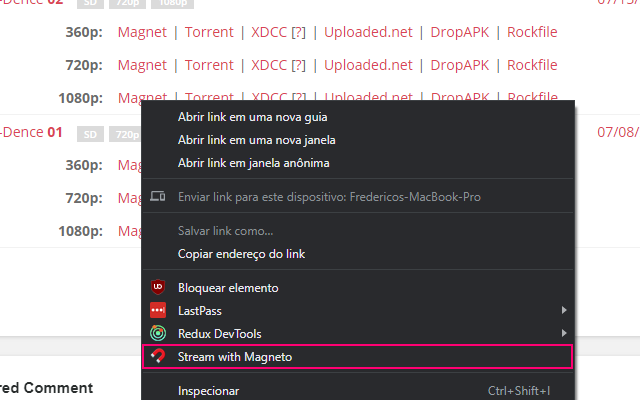

# 🧲 Magneto 
This is a little utility program to make streaming from magnet links into VLC easier. It is composed of **two** parts:
- **A Windows program** that will intercept the *magneto://* custom app protocol and launch peerflix
- A **Chrome extension** that will add a context menu entry on links to forward a magnet url to the desktop application.

## Dependencies
You need VLC installed in order for this to work properly.
- [VLC Media Player](https://www.videolan.org/)
___
## Installation
### Windows Desktop Client
To install the Windows desktop client, download and run the **MagnetoSetup.msi** file from the lastest release.

### Chrome Extension
You can either:
- Drag and drop the Extension folder into the *chrome://extensions* page with developer mode turned on

OR

- Wait for it to be approved on Chrome Web Store, I will share a link asap.
___

## Usage
With all prerequisites installed, using it should be as simple as right clicking on a *magnet* link on Chrome, choosing the **🧲 Stream with Magneto** option and click **Open Magneto** on the popup. This should open both a command prompt with the streaming URL and VLC.

____
### Credits
- Thanks to [Jozef Jaroščiak
](https://github.com/JozefJarosciak) for the great article about custom URI schemes in native Windows apps
- Thanks to [mafintosh](https://github.com/mafintosh) and the other peerflix contributors.